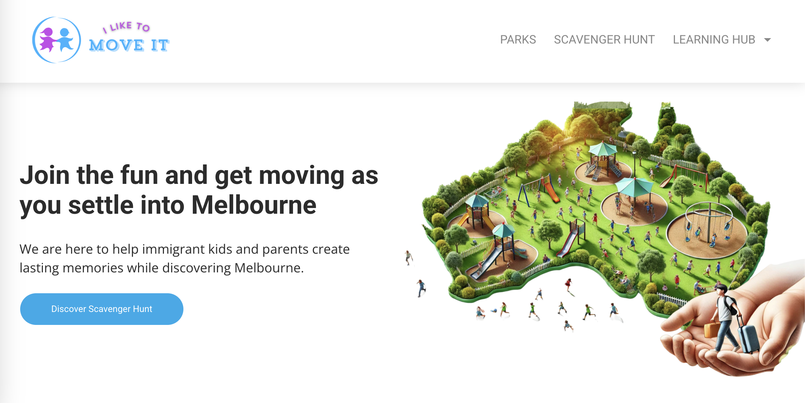
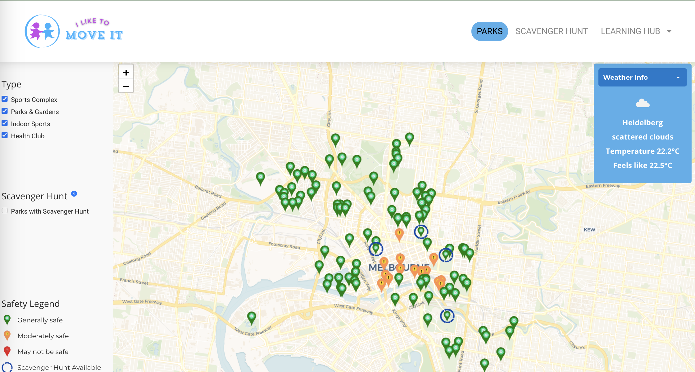
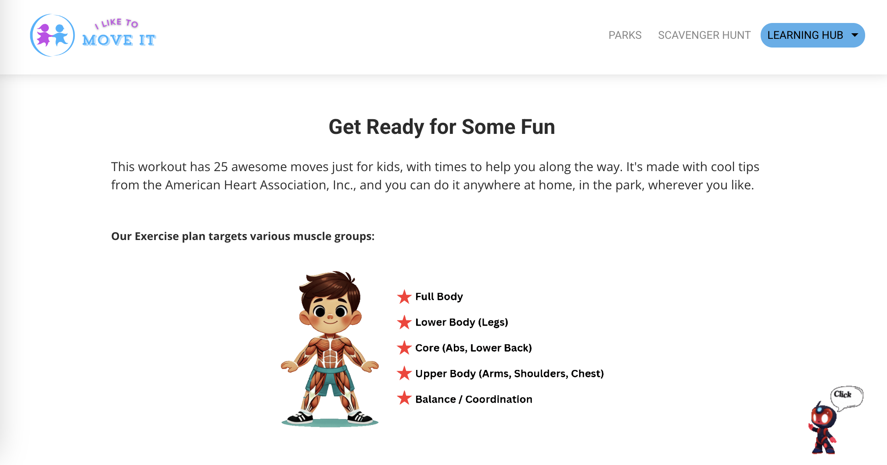
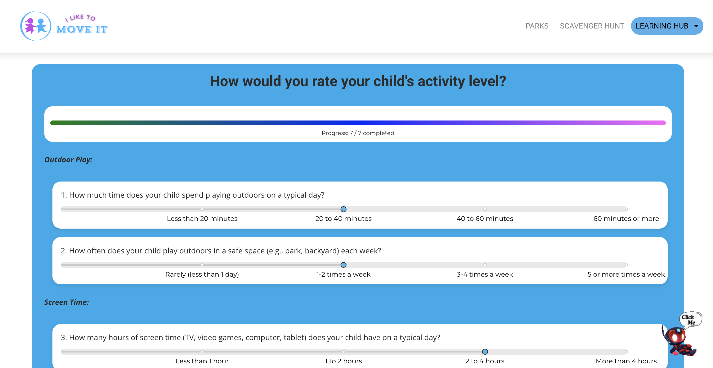
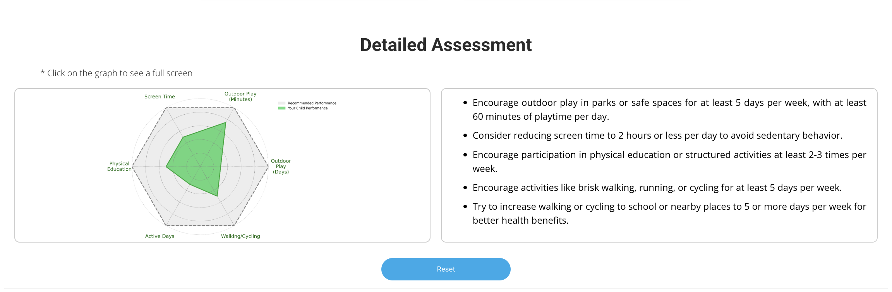

# I Like To Move It



## Project Overview
**Melbourne Children's Physical Activity Promotion** is a web-based solution designed to address the low levels of physical activity among immigrant children aged 5–14 in Melbourne. The platform overcomes barriers such as safety concerns, unfamiliarity with local facilities, and lack of guidance by offering interactive features and real-time resources.

## Table of Contents
- [I Like To Move It](#i-like-to-move-it)
  - [Project Overview](#project-overview)
  - [Table of Contents](#table-of-contents)
    - [My Role](#my-role)
  - [1. Background and Motivation](#1-background-and-motivation)
  - [2. Key Features](#2-key-features)
  - [3. Target Audience](#3-target-audience)
  - [4. Technology Stack](#4-technology-stack)
  - [5. Data Management](#5-data-management)
  - [6. Project Structure](#6-project-structure)
  - [7. Installation](#7-installation)
  - [8. Usage](#8-usage)
  - [9. Data Pipeline Overview](#9-data-pipeline-overview)
  - [10. Running Tests](#10-running-tests)
  - [11. Future Potential](#11-future-potential)
  - [12. Ethical, Legal, and Privacy Considerations](#12-ethical-legal-and-privacy-considerations)
  - [13. License](#13-license)
  - [14. Contact](#14-contact)

### My Role
As the **Data & Backend Lead**, I was responsible for developing and managing key aspects of the project’s technical foundation, including:

1. **Data Engineering**:
   - Designed and maintained a robust data pipeline, enabling seamless data ingestion, cleaning, transformation, and storage.
   - Implemented data wrangling techniques (e.g., handling missing values, deduplication, merging datasets) using Python libraries like `pandas` and `NumPy`.

2. **Database Design & Optimisation**:
   - Created a relational database schema to structure and integrate diverse datasets (e.g., crime, accident, and facility data).
   - Normalised data to eliminate redundancy and ensure efficient queries for analytics.

3. **Backend Development**:
   - Built and tested RESTful API endpoints using Python Flask to deliver real-time data for frontend features like interactive maps and safety ratings.
   - Integrated external APIs (OpenWeatherMap, Google Maps) to enhance user interactions and data reliability.

4. **Analytics & Insights**:
   - Generated actionable insights from historical and real-time data to power features like dynamic safety ratings and parental dashboards.
   - Used Python visualisation tools (e.g., Matplotlib) to create performance metrics (e.g., spider charts for physical activity assessments).

5. **Chatbot Development**:
   - Designed and implemented an AI-powered chatbot using the OpenAI API to assist users with activity recommendations, safety tips, and navigation support.
   - Developed a conversational system that maintains session context, ensuring continuity in user interactions.
   - Trained the chatbot with datasets including physical activity guidelines and navigation prompts, ensuring accurate, user-friendly responses.

## 1. Background and Motivation
Low physical activity levels affect a large portion of children in Melbourne, with additional challenges impacting those from immigrant backgrounds. This platform aims to increase engagement in safe physical activities by providing:
- Real-time safety data based on crime incidents, traffic accidents, and weather.
- Educational content covering physical activity benefits and safety tips.
- A chatbot that offers suggestions and translations.

## 2. Key Features
- **Interactive Map with Dynamic Safety Ratings**
  - Generates a location safety score based on crime data, traffic accidents, and weather.
  - Provides directions for walking or cycling when relevant.
  

- **Learning Hub**
  - Includes user-friendly content on physical activity benefits, guidelines, and first aid/safety practices.
  

- **AI Chatbot**
  - Provides on-the-fly translations and exercise recommendations.
  - Answers questions about health, safety, and navigation.
  

- **Parental Guidance Dashboard**
  - Returns a spider chart based on survey responses regarding a child’s activity.
  - Recommends strategies to meet official guidelines.
  
  

## 3. Target Audience
- **Primary**: Immigrant children aged 5–14 in Melbourne. They often lack familiarity with local environments and may require extra support in staying active.
- **Secondary**: Parents or guardians seeking reliable, real-time safety data and child-focused activity suggestions.

## 4. Technology Stack
- **Backend (Python Flask)**
  - Lightweight framework for server-side logic.
  - Suggested for production with Gunicorn and Nginx on a cloud instance.

- **Database**
  - SQLite for local development and quick prototyping.
  - AWS services can be used for scalable cloud-based deployments.

- **External Services**
  - Maps API for direction-related features.
  - Weather API for real-time meteorological data.
  - OpenAI API for chatbot interactions.

- **Testing**
  - Includes Python’s unittest framework for backend routes and functionalities.

## 5. Data Management
The system leverages both open-source and internally generated datasets, as outlined below:

- **Raw Data**
  - Includes accident records, crime incidents, landmarks, playgrounds, and facility details.
  - Generally updated annually (except real-time data like weather).

- **Processed Data**
  - Consolidates and cleans raw data into consistent formats.
  - Aggregates entries by suburb or geographic area.

- **Database Design**
  - Employs a central `Location` table linking to other tables (`Crime`, `Accident`, `Facility`, `Playground`, `Landmark`).
  - Additional tables (`Guideline`, `First Aid`, `Chatbot Training`) expand capabilities such as parental guidance and AI-powered interactions.

- **Privacy and Security**
  - Does not gather personal data from children.
  - Respects data licenses (e.g., Creative Commons) and relevant privacy principles.

## 6. Project Structure
```plaintext
alireza-dashchi-Melbourne-Childrens-Physical-Activity-Promotion/
├── LICENSE
├── Backend/
│   └── flask-app/
│       ├── app.py
│       ├── requirements.txt
│       ├── .gitignore
│       ├── database/
│       │   └── ILikeToMoveIt.db
│       ├── route_handlers/
│       │   ├── chat/
│       │   │   ├── get_chat_response.py
│       │   │   └── openai_chatbbot.py
│       │   ├── learning_hub/
│       │   │   └── get_questionnaire.py
│       │   ├── parent/
│       │   │   └── get_parental_guidance.py
│       │   └── parks/
│       │       ├── get_crime_accident_safety.py
│       │       ├── get_directions.py
│       │       ├── get_parks.py
│       │       └── get_weather_safety.py
│       ├── tests/
│       │   ├── test_flask_get_parental_guidance_cleanup_routes.py
│       │   ├── test_flask_get_parks_route.py
│       │   └── test_flask_prefetch_weather_data_route.py
│       └── util/
│           ├── api_catching.py
│           └── database.py
├── Data/
│   ├── Processed Data/
│   └── Raw Data/
├── Data_Pipeline/
│   ├── Data_Preparation/
│   │   ├── prepare_accident_data.py
│   │   ├── prepare_crime_data.py
│   │   ├── prepare_facility_data.py
│   │   └── prepare_playground.py
│   └── Data_Transfer/
│       └── transfer_data_to_db.py
└── Database/
    ├── ILikeToMoveIt.db
    └── initialise_database.py
```

## 7. Installation
1. Clone the repository.
2. Create a virtual environment and activate it.
3. Install necessary Python packages using the requirements file.
4. Ensure there is a valid database file (or run the initialization script).
5. Set environment variables for any required API keys (Maps, Weather, AI, etc.).

## 8. Usage
1. Launch the Flask server by running the main app file.
2. For production, it is recommended to run behind a WSGI server and reverse proxy.
3. Explore endpoints such as:
   - `/api/parks/get_parks` for obtaining locations and safety data
   - `/api/parks/prefetch_weather_data` for background weather data retrieval
   - `/api/parent/get_parental_guidance` for child activity assessments
   - `/api/chat/get_chat_response` for chatbot interactions
   - `/api/parks/get_directions` for route details

## 9. Data Pipeline Overview
- **Preparation**
  - Scripts in the `Data_Pipeline` folder remove duplicates, unify columns, and produce cleaned CSV outputs.
- **Transfer**
  - Automated or manual processes load processed CSV data into the main database.
- **Consumption**
  - Queries to the database power the safety rating calculations, and parental guidance features.

## 10. Running Tests
In the backend tests directory, there are test suites that verify:
- Parks endpoints and weather prefetch workflows.
- Parental guidance logic and cleanup routines.
- Chatbot routes.

Executing tests can be done by pointing `unittest` at the tests folder.

## 11. Future Potential
- **Geographical Expansion**
  - Can be extended to communities across Victoria and beyond.

- **Wearable Integration**
  - Optional pairing with trackers or smart devices for real-time step counts or alerts.

- **Additional Features**
  - Enhanced parental dashboards with progress tracking and advanced user engagement.
  - Partnerships with councils, NGOs, or other organisations.

## 12. Ethical, Legal, and Privacy Considerations
- Maintains transparency by using recognized open data licenses.
- Does not retain sensitive personal data.
- Adheres to privacy regulations and best practices.

## 13. License
Distributed under the MIT License. Refer to the license file for full details.

## 14. Contact
See the relevant repository or project homepage for contact information. Suggestions or contributions are appreciated.
